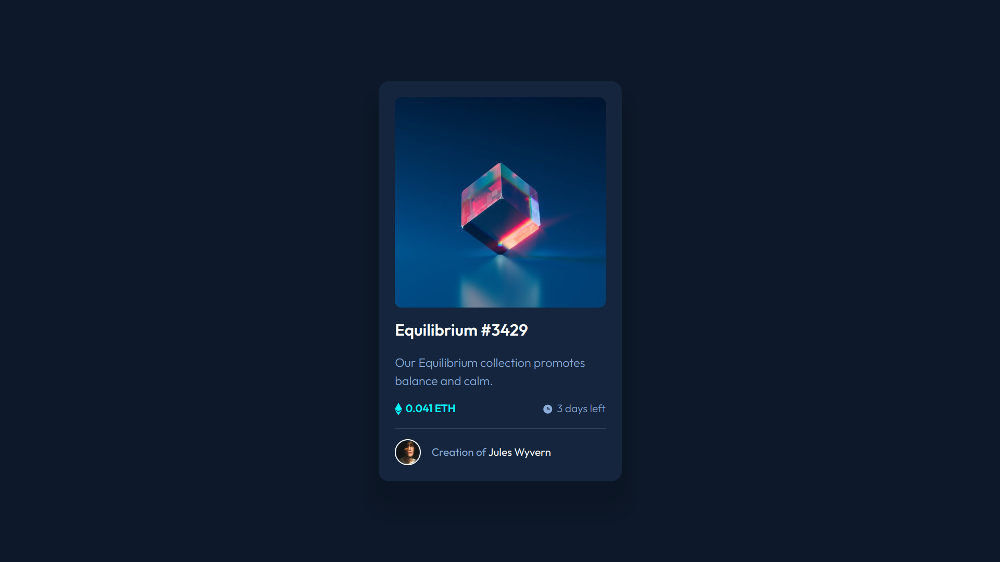

# Frontend Mentor - NFT preview card component solution

This is a solution to the [NFT preview card component challenge on Frontend Mentor](https://www.frontendmentor.io/challenges/nft-preview-card-component-SbdUL_w0U). Frontend Mentor challenges help you improve your coding skills by building realistic projects. 

## Table of contents

- [Overview](#overview)
  - [Screenshot](#screenshot)
  - [Links](#links)
- [My process](#my-process)
  - [Built with](#built-with)
  - [What I learned](#what-i-learned)
  - [Useful resources](#useful-resources)
- [Author](#author)

## Overview
A Simple website built with html and css.

### The challenge

Users should be able to:

- View the optimal layout depending on their device's screen size
- See hover states for interactive elements

### Screenshot

### Links

- Solution URL: [nft-preview-card-component-main](https://github.com/Attrams/nft-preview-card-component-main)
- Live Site URL: [nft-preview-card-component](https://app.netlify.com/sites/starlit-boba-32fa3e/overview)

### Built with

- Semantic HTML5 markup
- CSS custom properties
- Flexbox
- Mobile-first workflow

### What I learned

In this project the I learnt about the relative and absolute positions and also the align-self property.

### Useful resources
- [CSS Reset](https://piccalil.li/blog/a-modern-css-reset/)

## Author

- Website - [https://github.com/Attrams](https://github.com/Attrams)
- Frontend Mentor - [Attrams](https://www.frontendmentor.io/profile/Attrams)
- Twitter - [Attrams](https://www.twitter.com/papaattrams)
